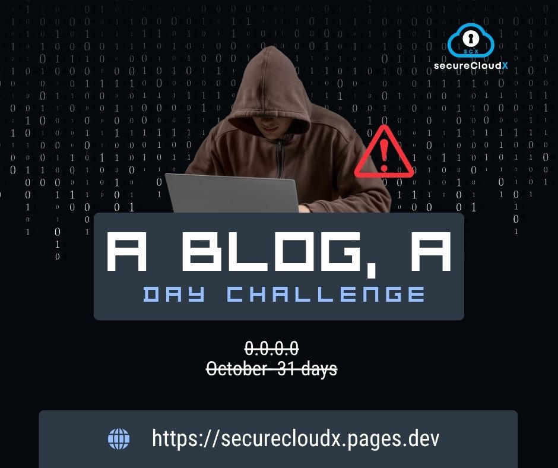

# Contributing to SecureCloudX Blog

<!-- October Blog-a-Day Challenge Banner with YouTube link -->
watch how to -> https://youtu.be/VxWAEoSQozc

[](https://youtu.be/VxWAEoSQozc)

```bash
root@securecloudx:~/blog$ ./contribute.sh --security-first
```

Welcome to the **SecureCloudX Blog** contribution guide! We're excited to have security professionals, researchers, and enthusiasts contribute to our growing knowledge base. This guide will help you understand our process, standards, and how to create impactful security content.

## 🎯 Our Mission

SecureCloudX believes in **democratizing security knowledge** through practical, hands-on content. We focus on:

- **Cloud Security Engineering**: DevSecOps, infrastructure security, compliance
- **Penetration Testing**: Practical labs, real-world scenarios, methodology
- **Security Research**: Vulnerability analysis, threat intelligence, tool development
- **Open Source Security**: Tool reviews, community projects, security automation

## 🔐 Content Categories

### Primary Focus Areas

```bash
# Core security domains we cover
/cloud-security/          # AWS, Azure, GCP security practices
/penetration-testing/     # Ethical hacking methodologies
/devsecops/              # Secure development practices
/vulnerability-research/  # CVE analysis, exploit development
/security-tools/         # Tool reviews and tutorials
/compliance/             # SOC2, ISO27001, PCI-DSS guides
```

### Content Types We Accept

- **Technical Tutorials**: Step-by-step security implementations
- **Lab Walkthroughs**: Practical penetration testing exercises
- **Tool Reviews**: In-depth analysis of security tools
- **Research Papers**: Original vulnerability research
- **Case Studies**: Real-world security incident analysis
- **Best Practices**: Industry-standard security guidelines

## 📝 Contribution Process

### Creating a New Blog Post

#### Method 1: Using the Blog Manager (Not-Recommended)

```bash
# Interactive mode
node scripts/blog-manager.js create

# Direct creation
node scripts/blog-manager.js create "Your Post Title" --tags security,cloud,tutorial
```

#### Method 2: Manual Creation - (easy to use)

1. Create a new `.md` file in `Docs/blogs/`
2. Add the post metadata to `Docs/blogs/blog-config.json`
3. Update the `blogFiles` array in `src/pages/OpenSourceBlog.jsx`

### Blog Post Structure

Every blog post should follow this structure:

```markdown
# Your Post Title

Brief introduction paragraph that will be used as the excerpt.

## Main Content

Your main content goes here with proper markdown formatting.

### Subsections

Use proper heading hierarchy for better organization.

## Code Examples

\`\`\`javascript
// Code blocks are highlighted automatically
function secureFunction() {
console.log("Security first!");
}
\`\`\`

## Conclusion

Wrap up your post with key takeaways.

---

_Learn more at [SecureCloudX](https://securecloudx.com)._
```

## Blog Manager Commands

```bash
# Create a new blog post
node scripts/blog-manager.js create

# List all blog posts
node scripts/blog-manager.js list

# Generate updated blog files array for React component
node scripts/blog-manager.js generate

# Validate all blog posts
node scripts/blog-manager.js validate
```

## File Structure

```
Docs/blogs/
├── blog-config.json          # Blog configuration and metadata
├── hello-open-source.md      # Sample blog post
├── cloud-security-fundamentals.md
├── secure-coding-practices.md
└── README.md                 # This file

src/pages/
└── OpenSourceBlog.jsx        # Main blog component

scripts/
└── blog-manager.js           # Blog management utility
```

## Configuration

The blog system is configured through `Docs/blogs/blog-config.json`:

```json
{
  "posts": [
    {
      "filename": "my-post.md",
      "title": "My Post Title",
      "date": "2025-08-31",
      "tags": ["security", "cloud"],
      "author": "Author Name"
    }
  ],
  "author": "Default Author",
  "baseUrl": "/Docs/blogs/",
  "siteConfig": {
    "title": "Blog Title",
    "description": "Blog description",
    "social": {
      "github": "https://github.com/username",
      "twitter": "https://twitter.com/username",
      "email": "email@example.com"
    }
  }
}
```

## Markdown Features Supported

### Text Formatting

- **Bold text** and _italic text_
- `Inline code`
- [Links](https://example.com)
- To highlight text, write it in bold.

### Code Blocks

```bash
# Bash commands
echo "Hello World"
```

```javascript
// JavaScript code
console.log("Hello World");
```

```python
# Python code
print("Hello World")
```

### Lists

- Unordered lists
- With multiple items
- And nested items

1. Ordered lists
2. Are also supported
3. With proper numbering

### Tables

| Column 1 | Column 2 | Column 3 |
| -------- | -------- | -------- |
| Data 1   | Data 2   | Data 3   |

### Blockquotes

> Important information or quotes
> can be highlighted like this

### Images


## Best Practices

### Writing Guidelines

1. **Start with a compelling title** that accurately reflects the content
2. **Write a clear introduction** that hooks the reader
3. **Use proper heading hierarchy** (H2, H3, H4) for organization
4. **Include code examples** when discussing technical topics
5. **End with actionable takeaways** or next steps

### Technical Guidelines

1. **Keep filenames lowercase** with hyphens (kebab-case)
2. **Use descriptive filenames** that match the post title
3. **Add appropriate tags** for categorization
4. **Test your markdown** before publishing
5. **Include proper alt text** for images
6. **Use semantic HTML** in markdown when needed

### SEO and Accessibility

1. **Write descriptive headings** that outline the content structure
2. **Use alt text for images** to improve accessibility
3. **Keep paragraphs concise** for better readability
4. **Include internal and external links** where relevant
5. **Use proper code highlighting** for better user experience

## Troubleshooting

### Common Issues

**Blog post not showing up:**

1. Check that the file exists in `Docs/blogs/`
2. Verify the filename in `blog-config.json` matches exactly
3. Ensure the `blogFiles` array in `OpenSourceBlog.jsx` is updated

**Markdown not rendering correctly:**

1. Check for proper markdown syntax
2. Ensure code blocks use three backticks
3. Verify heading hierarchy (don't skip levels)

**Search not working:**

1. Check that post title and content are properly formatted
2. Verify tags are correctly assigned
3. Clear browser cache if needed

### Getting Help

If you encounter issues:

1. Check the browser console for errors
2. Validate your markdown syntax
3. Run `node scripts/blog-manager.js validate` to check for issues
4. Review the blog configuration file for errors

## 📤 Submission Process

### Creating a Pull Request

```bash
# 1. Commit your changes
git add .
git commit -m "feat: add blog post on cloud security monitoring"

# 2. Push to your fork
git push origin blog/your-topic-name

# 3. Create pull request
```

### Review Process

1. **Initial Review** (2-3 days)

   - Technical accuracy check
   - Security content review
   - Writing quality assessment

2. **Feedback Round** (if needed)

   - Address reviewer comments
   - Make requested changes
   - Re-submit for review

3. **Final Approval**
   - Content merged to main branch
   - Blog post goes live
   - Author attribution added

## 🏆 Recognition

### Contributor Benefits

- **Author bio** on published posts
- **GitHub profile** linked in contributor section
- **Social media shoutouts** for quality content
- **Priority review** for future submissions
- **Community recognition** in our Hall of Fame

---

Happy blogging! 🚀
